# 同步决策文档 (Sync Decision Document)

本文档详细描述了 Obsidian WebDAV Sync 插件的同步决策引擎,涵盖三路合并原理、决策状态机、冲突解决策略等核心机制。

---

## 目录

1. [架构概览](#1-架构概览)
2. [三路合并原理 (Three-way Merge)](#2-三路合并原理-three-way-merge)
3. [数据库结构 (SyncDB)](#3-数据库结构-syncdb)
4. [决策输入](#4-决策输入)
5. [决策状态机](#5-决策状态机)
6. [文件类型决策](#6-文件类型决策)
7. [目录类型决策](#7-目录类型决策)
8. [冲突解决策略](#8-冲突解决策略)
9. [约束条件检查](#9-约束条件检查)
10. [任务排序](#10-任务排序)
11. [类型冲突检测](#11-类型冲突检测)
12. [端到端加密支持](#12-端到端加密支持)

---

## 1. 架构概览

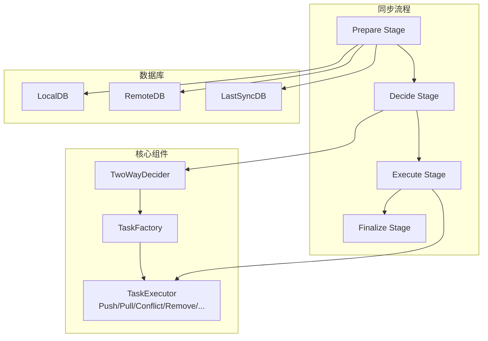

### 核心组件

| 组件                    | 文件                                              | 职责                  |
|-----------------------|-------------------------------------------------|---------------------|
| `TwoWaySyncDecider`   | `src/sync/decision/two-way.decider.ts`          | 决策器主类,协调决策流程        |
| `twoWayDecider()`     | `src/sync/decision/two-way.decider.function.ts` | 核心决策函数,包含状态机逻辑      |
| `BaseSyncDecider`     | `src/sync/decision/base.decider.ts`             | 决策器基类,提供上下文访问       |
| `SyncDB`              | `src/sync/db/sync-db.ts`                        | SQLite 数据库封装,存储文件状态 |
| `TaskFactory`         | `src/sync/decision/sync-decision.interface.ts`  | 任务工厂接口定义            |
| `ConflictResolveTask` | `src/sync/tasks/conflict-resolve.task.ts`       | 冲突解决任务执行            |

---

## 2. 三路合并原理 (Three-way Merge)

### 2.1 基本概念

三路合并是同步系统的核心算法,通过比较三个版本来确定同步操作:

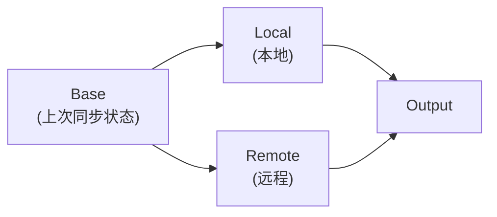

### 2.2 变更检测

通过 Hash 比较检测变更:

```typescript
// 本地变更检测
const localChanged = local ? local.hash !== last.hash : true

// 远程变更检测
const remoteChanged = remote ? remote.hash !== last.hash : true
```

| 状态                          | 含义         |
|-----------------------------|------------|
| `local.hash !== last.hash`  | 本地文件已修改或删除 |
| `remote.hash !== last.hash` | 远程文件已修改或删除 |
| `hash = ''` (空哈希)           | 目录标记       |
| `last 不存在`                  | 无历史记录(新文件) |

### 2.3 三种情况

#### 情况 A:本地和远程都无变更

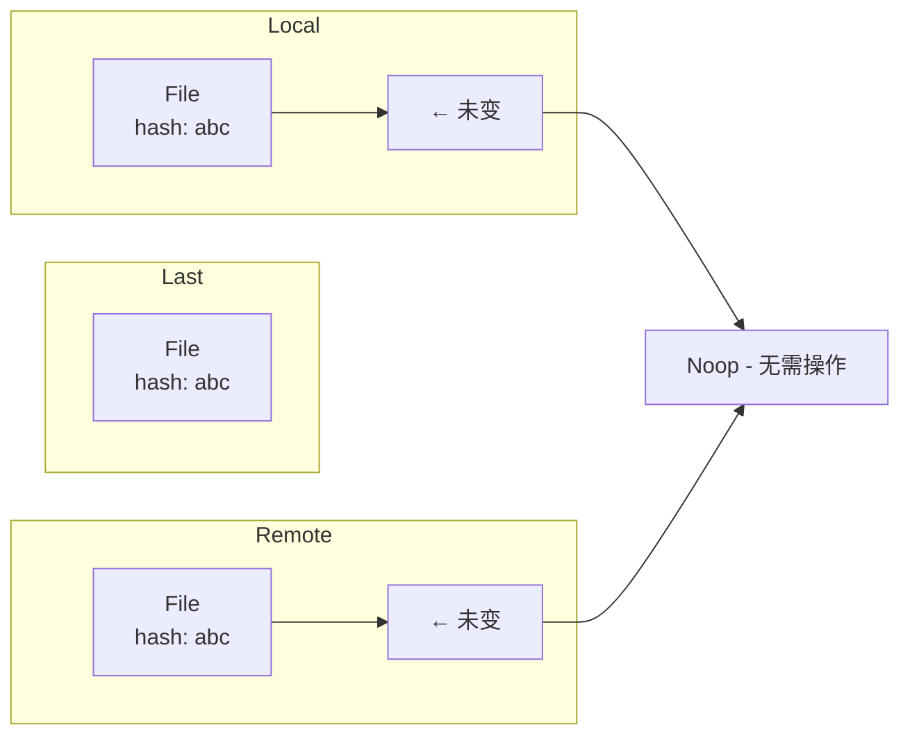

**决策**:`Noop` - 无需操作

#### 情况 B:只有一方变更

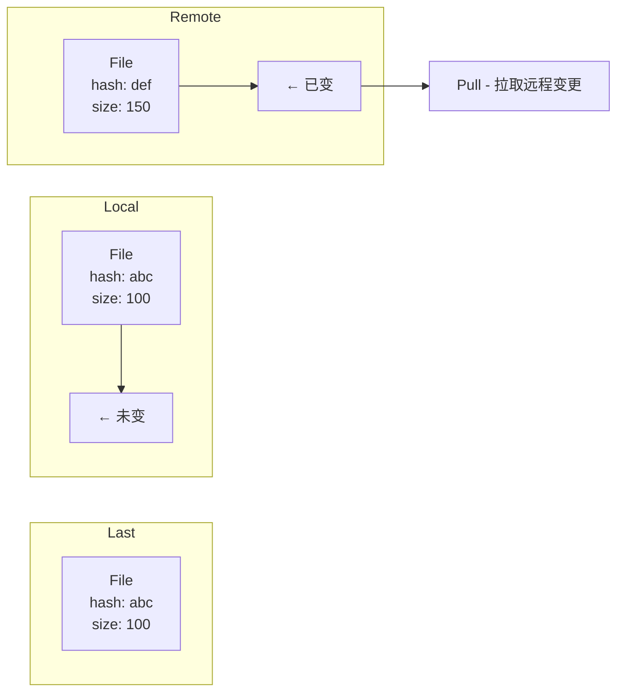

**决策**:`Pull` - 拉取远程变更到本地

或反向情况:`Push` - 推送本地变更到远程

#### 情况 C:双方都变更

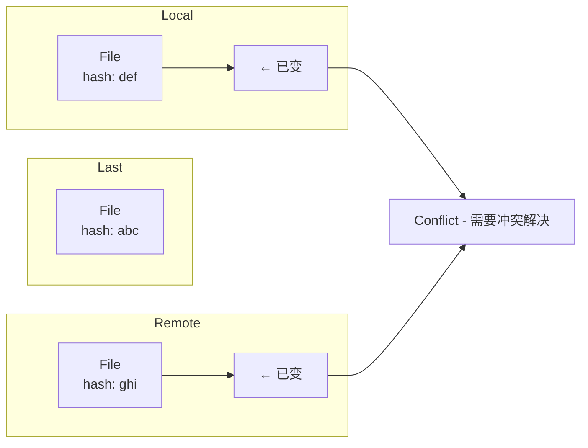

**决策**:`Conflict` - 需要冲突解决

---

## 3. 数据库结构 (SyncDB)

### 3.1 SQLite 表结构

```sql
-- 文件表
CREATE TABLE files
(
    path               TEXT PRIMARY KEY,
    mtime              INTEGER NOT NULL,  -- 文件修改时间
    size               INTEGER NOT NULL,  -- 文件大小
    hash               TEXT    NOT NULL,  -- SHA-256 哈希
    is_dir             INTEGER DEFAULT 0, -- 是否为目录
    first_seen_at      INTEGER,           -- 首次发现时间
    content_changed_at INTEGER,           -- 内容变更时间
    last_synced_at     INTEGER            -- 上次同步时间
)

-- 元数据表
CREATE TABLE meta
(
    key   TEXT PRIMARY KEY,
    value TEXT
)

-- 设备表
CREATE TABLE devices
(
    device_id      TEXT PRIMARY KEY,
    device_name    TEXT,
    platform       TEXT,
    last_online_at INTEGER,
    first_seen_at  INTEGER
)

-- 同步会话表
CREATE TABLE sync_sessions
(
    session_id TEXT PRIMARY KEY,
    device_id  TEXT,
    started_at INTEGER,
    -- ... 统计信息
)
```

### 3.2 三个 DB 的关系

```typescript
interface ThreeDBs {
	localDB: SyncDB  // 本地 Vault 当前状态
	remoteDB: SyncDB  // 远程上次同步状态
	lastSyncDB: SyncDB // 上次成功同步的状态快照
}
```

### 3.3 DBFile 结构

```typescript
interface DBFile {
	path: string           // 文件路径
	mtime: number          // 修改时间戳
	size: number           // 文件大小
	hash: string          // SHA-256 哈希
	isDir: number          // 0=文件, 1=目录
	firstSeenAt: number    // 首次发现时间
	contentChangedAt: number // 内容变更时间
	lastSyncedAt: number   // 上次同步时间
}
```

---

## 4. 决策输入

### 4.1 SyncDecisionInput 接口

```typescript
interface SyncDecisionInput {
	settings: SyncDecisionSettings   // 用户设置
	localDB: SyncDB                  // 本地数据库
	remoteDB: SyncDB                 // 远程数据库
	lastSyncDB: SyncDB              // 上次同步数据库
	remoteBaseDir: string           // 远程基础目录
	taskFactory: TaskFactory        // 任务工厂
}
```

### 4.2 SyncDecisionSettings

```typescript
interface SyncDecisionSettings {
	skipLargeFiles: { maxSize: string }      // 大文件跳过限制
	conflictStrategy: ConflictStrategy       // 冲突解决策略
	useGitStyle: boolean                      // 是否使用 Git 风格合并标记
	syncMode: SyncMode                       // 同步模式
	configDir: string                         // 配置文件目录
	encryptionEnabled: boolean               // 是否启用加密
}
```

---

## 5. 决策状态机

### 5.1 总体流程

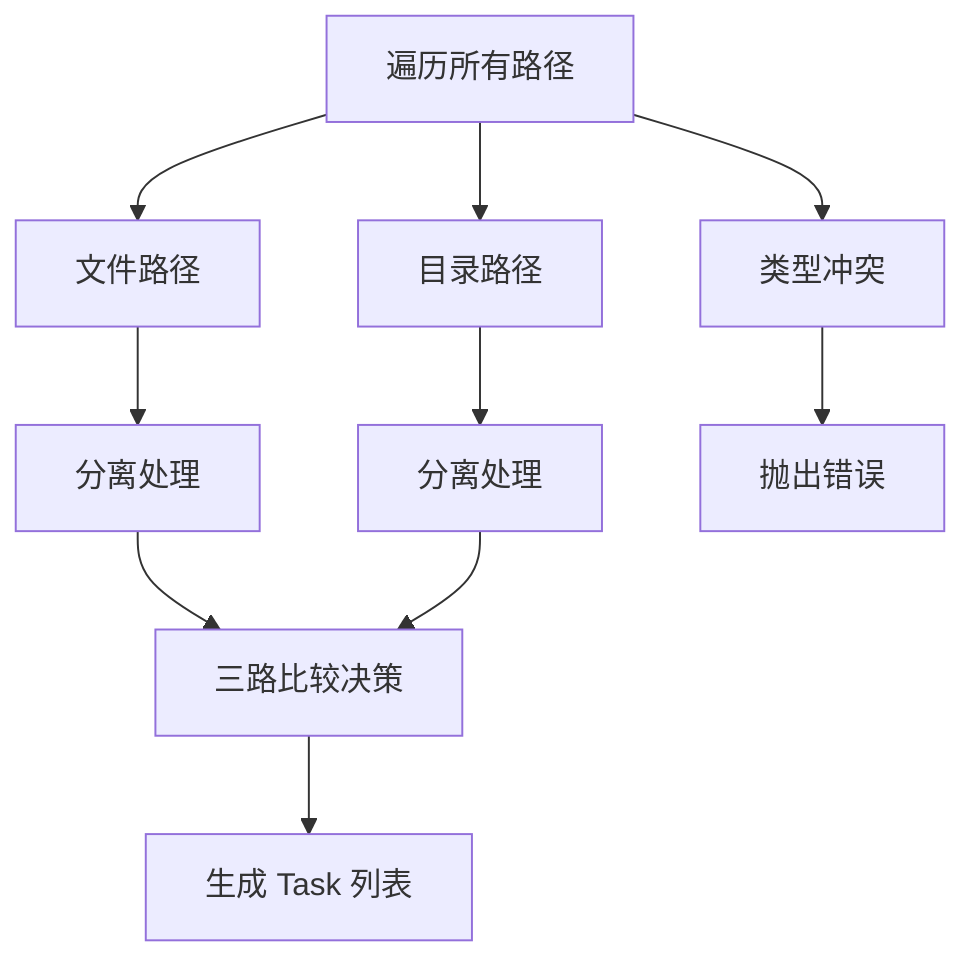

### 5.2 决策条件分支

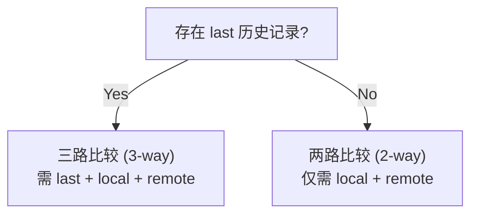

---

## 6. 文件类型决策

### 6.1 三路比较决策表(有历史记录)

| Local | Remote | last.hash | localChanged | remoteChanged | 决策            | 任务类型               |
|-------|--------|-----------|--------------|---------------|---------------|--------------------|
| ✓     | ✓      | ✓         | ✗            | ✗             | Noop          | `noop`             |
| ✓     | ✓      | ✓         | ✓            | ✗             | Push          | `push`             |
| ✓     | ✓      | ✓         | ✗            | ✓             | Pull          | `pull`             |
| ✓     | ✓      | ✓         | ✓            | ✓             | **Conflict**  | `conflict-resolve` |
| ✓     | ✗      | ✓         | ✗            | -             | Remove Local  | `remove-local`     |
| ✓     | ✗      | ✓         | ✓            | -             | Push          | `push`             |
| ✗     | ✓      | ✓         | -            | ✗             | Remove Remote | `remove-remote`    |
| ✗     | ✓      | ✓         | -            | ✓             | Pull          | `pull`             |
| ✗     | ✗      | ✓         | -            | -             | (无需操作)        | -                  |

### 6.2 两路比较决策表(无历史记录)

| Local | Remote | Local hash = Remote hash | 决策           | 任务类型               |
|-------|--------|--------------------------|--------------|--------------------|
| ✓     | ✓      | ✓                        | Noop         | `noop`             |
| ✓     | ✓      | ✗                        | **Conflict** | `conflict-resolve` |
| ✓     | ✗      | -                        | Push         | `push`             |
| ✗     | ✓      | -                        | Pull         | `pull`             |

### 6.3 约束条件优先级

在执行任何操作前,按以下顺序检查约束条件:

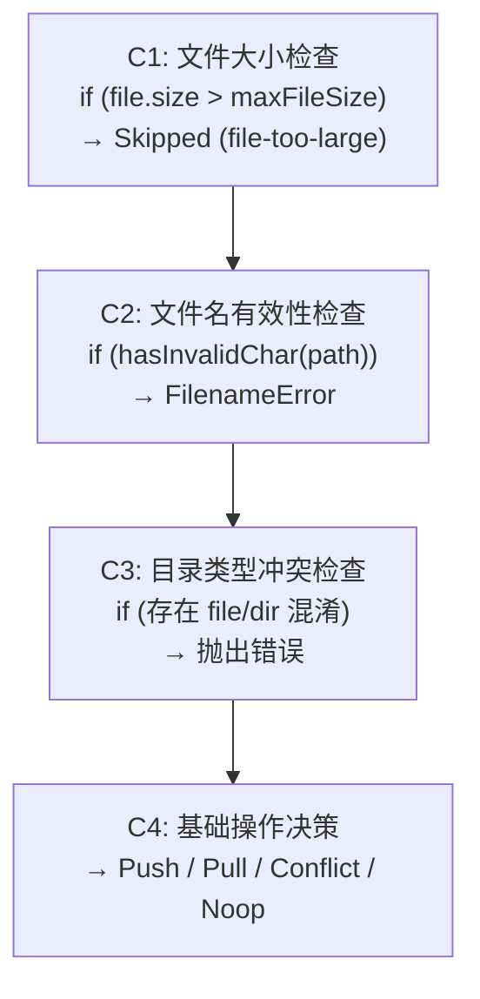

### 6.4 完整决策流程图

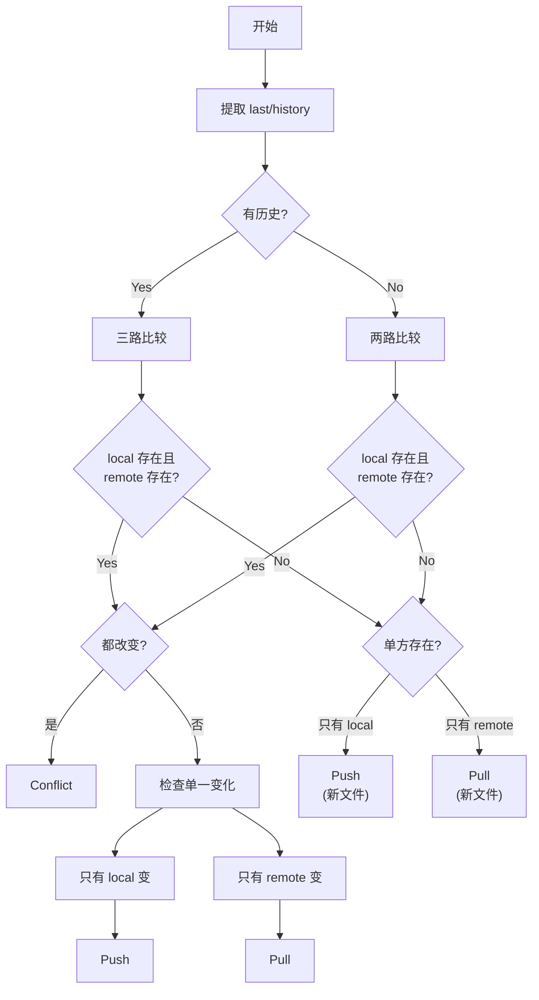

---

## 7. 目录类型决策

### 7.1 目录决策规则

| Local | Remote | 决策           | 任务类型           |
|-------|--------|--------------|----------------|
| ✓     | ✓      | Noop         | `noop`         |
| ✓     | ✗      | Mkdir Remote | `mkdir-remote` |
| ✗     | ✓      | Mkdir Local  | `mkdir-local`  |

### 7.2 目录特殊性

- 目录使用空哈希值 (`hash = ''`) 区分
- 目录不进行内容比较,仅检查存在性
- 目录创建顺序:先创建父目录,再创建子目录

---

## 8. 冲突解决策略

### 8.1 ConflictStrategy 枚举

```typescript
enum ConflictStrategy {
	DiffMatchPatch = 'diff-match-patch',        // 智能三向合并
	LatestTimeStamp = 'latest-timestamp',      // 基于时间戳
	Skip = 'skip',                              // 跳过冲突
	DiffMatchPatchOrSkip = 'diff-match-patch-or-skip' // 尝试合并,失败则跳过
}
```

### 8.2 DiffMatchPatch 策略

**算法**:优先使用 `diff3Merge` 三向合并,失败时使用 `diff-match-patch`。

```typescript
async
execIntelligentMerge()
{
	// 1. 加载本地和远程内容
	const localText = await readLocal()
	const remoteText = await readRemote()

	// 2. 尝试 diff3Merge 三向合并
	const diff3Result = diff3MergeStrings(base, localText, remoteText)

	if (diff3Result !== false) {
		// 合并成功
		return mergedText
	}

	// 3. 降级到 diff-match-patch
	const [dmpText, success] = dmp.patch_apply(patches, localText)

	if (!success) {
		// 4. 再次降级到 mergeDigIn
		return mergeDigIn(localText, localText, remoteText)
	}

	return dmpText
}
```

### 8.3 LatestTimeStamp 策略

**规则**:选择修改时间较新的文件。

```typescript
function resolveByLatestTimestamp(params) {
	const { localMtime, remoteMtime, localContent, remoteContent } = params

	if (isSameTime(remoteMtime, localMtime)) {
		return { status: NoChange }
	}

	const useRemote = remoteMtime > localMtime

	if (!isEqual(localContent, remoteContent)) {
		return useRemote
			? { status: UseRemote, content: remoteContent }
			: { status: UseLocal, content: localContent }
	}

	return { status: NoChange }
}
```

### 8.4 配置目录特殊处理

配置文件目录 (`.obsidian`) 强制使用 `LatestTimeStamp` 策略:

```typescript
function pickConflictStrategy(
	path: string,
	configDir: string,
	userStrategy: ConflictStrategy
): ConflictStrategy {
	if (path === configDir || path.startsWith(configDir + '/')) {
		return ConflictStrategy.LatestTimeStamp
	}
	return userStrategy
}
```

---

## 9. 约束条件检查

### 9.1 大文件跳过 (C1)

```typescript
const maxFileSizeStr = settings.skipLargeFiles.maxSize.trim()
if (maxFileSizeStr !== '') {
	maxFileSize = bytesParse(maxFileSizeStr, { mode: 'jedec' }) ?? Infinity
}

// 检查
if (local.size > maxFileSize || remote.size > maxFileSize) {
	return taskFactory.createSkippedTask({
		reason: 'file-too-large',
		maxSize,
		localSize: local?.size,
		remoteSize: remote?.size
	})
}
```

### 9.2 文件名有效性检查 (C3)

检查文件名是否包含 WebDAV 不支持的字符:

```typescript
import { hasInvalidChar } from '~/utils/has-invalid-char'

if (hasInvalidChar(path)) {
	return taskFactory.createFilenameErrorTask(opts(path))
}
```

### 9.3 类型冲突检测 (C2)

检测同一路径在一个数据库中是文件,在另一个中是目录:

```typescript
const types = new Set<number>()
if (local) types.add(local.isDir)
if (remote) types.add(remote.isDir)
if (last) types.add(last.isDir)

if (types.size > 1) {
	throw new Error(
		`Path "${p}" type conflict: file in one database, directory in another`
	)
}
```

---

## 10. 任务排序

### 10.1 排序规则 (I2)

任务执行顺序优化,确保操作安全:

```mermaid
gantt
    title 任务执行顺序
    dateFormat X
    axisFormat %s

    section Phase 1
        Remove (深度优先,降序): remove, 0, 10

    section Phase 2
        Mkdir (广度优先,升序): mkdir, 15, 25

    section Phase 3
        File Operations (保持顺序): file, 30, 50
```

| Phase   | 操作              | 排序策略 | 说明                          |
|---------|-----------------|------|-----------------------------|
| Phase 1 | Remove          | 深度降序 | 删除远程/本地: deepest first      |
| Phase 2 | Mkdir           | 广度升序 | 创建远程/本地目录: shallowest first |
| Phase 3 | File Operations | 保持顺序 | Push / Pull / Conflict 等    |

### 10.2 排序实现

```typescript
// 深度计算
function countDepth(path: string): number {
	return path.split('/').length - 1
}

// Remove 任务:深度降序(先删深层)
removeTasks.sort((a, b) =>
	countDepth(b.localPath) - countDepth(a.localPath)
)

// Mkdir 任务:深度升序(先建浅层)
mkdirTasks.sort((a, b) =>
	countDepth(a.localPath) - countDepth(b.localPath)
)

// 最终顺序
return [...removeTasks, ...mkdirTasks, ...fileTasks]
```

### 10.3 排序原因

| 场景       | 原因             |
|----------|----------------|
| 先删深层再删浅层 | 删除父目录前确保子目录已清空 |
| 先建浅层再建深层 | 确保父目录存在后再创建子目录 |
| 文件操作放最后  | 依赖目录结构已完成      |

---

## 11. 类型冲突检测

### 11.1 问题场景

可能导致同一路径在不同时刻被不同设备标记为不同类型:

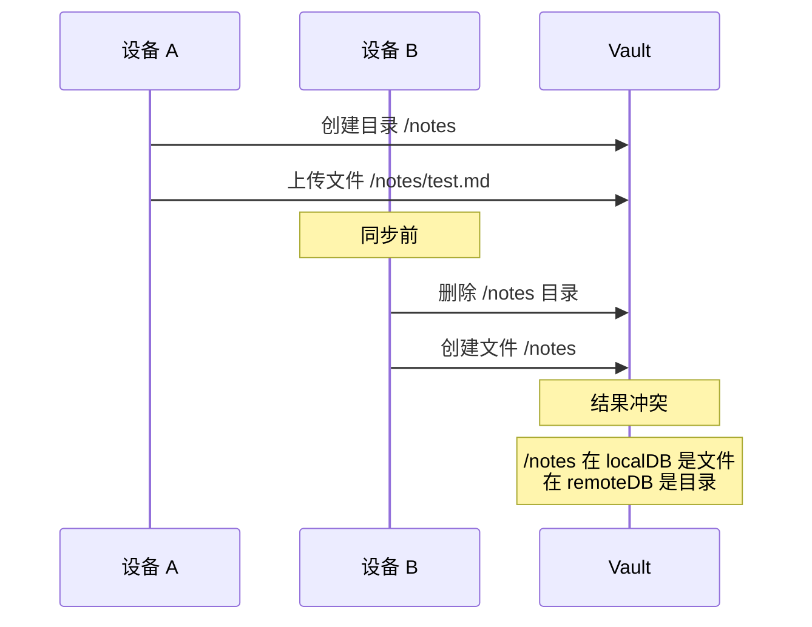

### 11.2 检测逻辑

```typescript
for (const p of allPaths) {
	const local = localFiles.get(p)
	const remote = remoteFiles.get(p)
	const last = lastSyncFiles.get(p)

	const types = new Set<number>()
	if (local) types.add(local.isDir)
	if (remote) types.add(remote.isDir)
	if (last) types.add(last.isDir)

	if (types.size > 1) {
		throw new Error(
			`Path "${p}" type conflict: file in one database, directory in another`
		)
	}
}
```

---

## 12. 端到端加密支持

### 12.1 加密流程

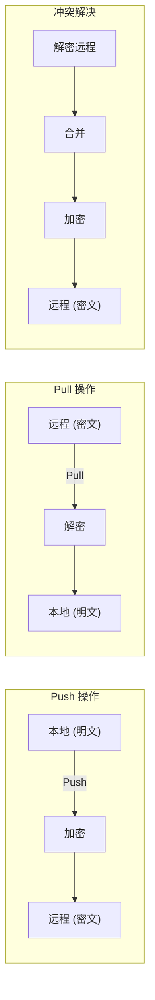

### 12.2 加密实现

```typescript
import { decrypt, encrypt } from '~/crypto'

// Push 操作
async
exec()
{
	const content = await this.vault.adapter.readBinary(this.localPath)
	const encrypted = await encrypt(content, this.encryptionKey)
	await this.webdav.putFileContents(this.remotePath, encrypted)
}

// Pull 操作
async
exec()
{
	const encrypted = await this.webdav.getFileContents(this.remotePath)
	const content = await decrypt(encrypted, this.encryptionKey)
	await this.vault.adapter.writeBinary(this.localPath, content)
}

// 冲突解决
async
execIntelligentMerge()
{
	// 1. 解密远程内容
	const remoteContent = await decrypt(remoteBuffer, this.encryptionKey)

	// 2. 执行合并
	const mergedText = await resolveByIntelligentMerge(...)

	// 3. 加密后上传
	const encrypted = await encrypt(textToArrayBuffer(mergedText), this.encryptionKey)
	await this.webdav.putFileContents(this.remotePath, encrypted)
}
```

### 12.3 加密算法

| 参数        | 值                      |
|-----------|------------------------|
| 对称加密      | AES-256-GCM            |
| 密钥派生      | PBKDF2 + SHA-256       |
| 迭代次数 (桌面) | 600,000                |
| 迭代次数 (移动) | 100,000                |
| 密钥存储      | Obsidian SecretStorage |

---

## 附录 A:任务类型列表

| 任务类型                        | 类名                            | 描述        |
|-----------------------------|-------------------------------|-----------|
| `push`                      | `PushTask`                    | 推送本地文件到远程 |
| `pull`                      | `PullTask`                    | 拉取远程文件到本地 |
| `conflict-resolve`          | `ConflictResolveTask`         | 解决冲突      |
| `noop`                      | `NoopTask`                    | 无操作(状态记录) |
| `remove-local`              | `RemoveLocalTask`             | 删除本地文件    |
| `remove-remote`             | `RemoveRemoteTask`            | 删除远程文件    |
| `remove-remote-recursively` | `RemoveRemoteRecursivelyTask` | 递归删除远程目录  |
| `mkdir-local`               | `MkdirLocalTask`              | 创建本地目录    |
| `mkdir-remote`              | `MkdirRemoteTask`             | 创建远程目录    |
| `mkdirs-remote`             | `MkdirsRemoteTask`            | 批量创建远程目录  |
| `skipped`                   | `SkippedTask`                 | 跳过(记录原因)  |
| `filename-error`            | `FilenameErrorTask`           | 文件名错误     |
| `clean-record`              | `CleanRecordTask`             | 清理记录      |

---

## 附录 B：决策树速查表

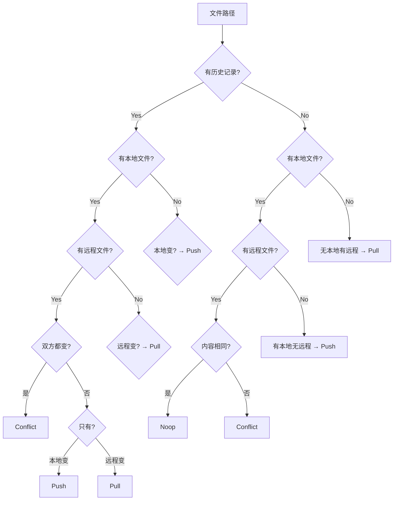

---

*文档版本: 1.0*
*最后更新: 2024-05-07*
*相关文件: `src/sync/decision/*`*