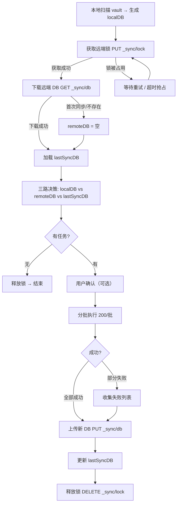
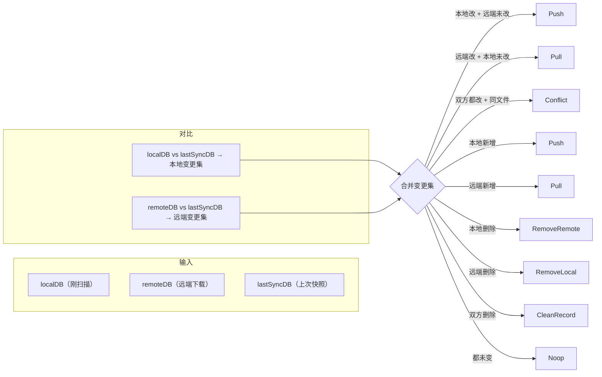
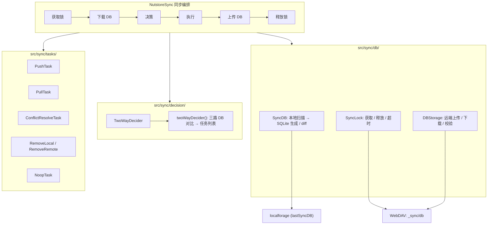

# 同步决策方案重新设计

## 目标

用本地数据库替代远程 PROPFIND 目录扫描，消除同步决策对远程遍历的依赖。

核心思路：每个设备维护 SQLite 数据库（包含所有文件的 mtime + SHA-256 hash），同步时上传到远端。其他设备下载数据库文件即可了解远端状态，不再需要递归扫描远程目录。

---

## 1. 数据库 Schema & 存储

**格式**：SQLite (sql.js)，单文件，体积约为 JSON 的 1/3。

**远端路径**：`{remoteBaseDir}/_sync/db`（单一文件，每次覆盖写入）

**表结构**：

```sql
CREATE TABLE files (
  path      TEXT PRIMARY KEY,   -- 相对路径
  mtime     INTEGER NOT NULL,   -- 修改时间 (Unix ms)
  size      INTEGER NOT NULL,   -- 文件大小 (bytes)
  hash      TEXT NOT NULL,      -- SHA-256 hex (64 chars)
  is_dir    INTEGER DEFAULT 0   -- 是否目录
);

CREATE TABLE meta (
  key       TEXT PRIMARY KEY,
  value     TEXT
);
-- meta 行: version, device_id, created_at
```

**本地持久化**（localforage）：

| Key | 内容 | 用途 |
|-----|------|------|
| `lastSyncDB` | 上次同步完成时的 files 表完整快照 | 三路决策的基线 |
| `lastKnownVersion` | 上次同步完成时的版本号 | 快速判断是否有远端更新 |
| `deviceId` | 本设备 UUID | 锁持有者标识 |

**体积估算**：5000 文件约 400KB，10000 文件约 800KB。

---

## 2. 远程读写锁

**锁文件**：`{remoteBaseDir}/_sync/lock`

**锁内容**（JSON）：

```typescript
interface SyncLock {
  deviceId: string      // 持有者设备 ID
  acquiredAt: number    // 获取时间戳 (Unix ms)
  version: number       // 当前远端 DB 版本号
  token: string         // 随机令牌，防止误删
}
```

**获取锁**：

1. `GET _sync/lock`
2. 若 404 → `PUT _sync/lock`（写入锁信息）→ `GET _sync/lock` 验证 token 匹配 → 成功
3. 若 200 → 检查是否过期（超时 5 分钟）：
   - 过期 → `PUT` 覆盖 + 回读验证 → 成功
   - 未过期 → 等待重试（指数退避，最多等 5 分钟）

**释放锁**：`DELETE _sync/lock`（仅当 token 匹配时执行）

**超时**：5 分钟。正常同步完成后立即释放。持锁设备崩溃/断网时，其他设备可在超时后抢占。

---

## 3. 决策算法

**三路对比**：`localDB`（刚扫描） vs `remoteDB`（远端下载） vs `lastSyncDB`（上次同步快照）

以 lastSyncDB 为基线，分别计算本地变更集和远端变更集：

| localDB vs lastSyncDB | remoteDB vs lastSyncDB | 决策 |
|------------------------|------------------------|------|
| 未变 | 未变 | **Noop** |
| 已改 (hash 不同) | 未变 | **Push** |
| 未变 | 已改 (hash 不同) | **Pull** |
| 已改 | 已改 | **Conflict** → 合并策略 |
| 新增 | 无 | **Push** |
| 无 | 新增 | **Pull** |
| 删除 | 未变 | **RemoveRemote** |
| 未变 | 删除 | **RemoveLocal** |
| 删除 | 删除 | **CleanRecord** |

**变更判断**：直接比较 hash 值，不再使用 mtime 的 `isSameTime` 容差判断。hash 精确决定了内容是否变化。

**文件夹**：通过 `is_dir=1` 区分，新增/删除逻辑与文件一致。

**冲突处理**：保留现有的 diff-match-patch 三方合并和 timestamp 优先两种策略，由用户设置决定。

---

## 4. 同步流程

```
1. 本地扫描 → 生成 localDB
   遍历 vault，计算每个文件的 mtime/size/SHA-256 hash

2. 获取远端锁
   PUT _sync/lock → 回读验证 token

3. 下载远端 DB
   GET _sync/db → 不存在则视为空 DB（首次同步）

4. 加载 lastSyncDB
   从 localforage 读取（首次同步则为空 DB）

5. 三路决策
   localDB vs remoteDB vs lastSyncDB → Push/Pull/Conflict/Remove/Noop 任务列表

6. 用户确认（可选）
   若开启"同步前确认"，弹出任务预览 Modal

7. 执行任务
   分批执行（200/批）→ 503 自动等待 60s 重试 → 取消检测

8. 上传新 DB
   PUT _sync/db（覆盖写入）

9. 本地收尾
   更新 lastSyncDB (localforage)、更新 lastKnownVersion

10. 释放锁
    DELETE _sync/lock
```

---

## 5. 错误处理

| 场景 | 处理 |
|------|------|
| 锁超时 | 等待设备可在 5 分钟后抢占，写入新 token + 回读验证 |
| DB 不存在（首次同步） | remoteDB 视为空，所有本地文件生成 Push 任务 |
| DB 损坏（SQLite 校验失败） | 视为远端无 DB，走全量 Push，上传新 DB 覆盖 |
| lastSyncDB 不存在 | 视为空 DB，差异由 localDB vs remoteDB 决定 |
| 同步中途中断 | 锁未释放 → 超时后其他设备可抢占；DB 未上传 → 下次同步 hash 对比修正 |
| PUT 失败（空间不足） | 回滚，不更新 lastSyncDB，释放锁，提示用户 |
| 两个设备同时抢占锁 | 各自写入后回读验证 token → token 不匹配的一方主动放弃 |

---

## 6. 架构变更

**新增模块**：

```
src/sync/db/
├── sync-db.ts        # SyncDB: 本地扫描 → SQLite 生成、查询、diff
├── db-storage.ts     # DBStorage: 远端上传/下载/校验
└── sync-lock.ts      # SyncLock: 获取/释放/超时检测
```

**保留模块**：

```
src/sync/tasks/           # Task 模式（不变）
src/sync/core/merge-utils.ts  # 冲突合并（不变）
src/sync/decision/        # Decider 简化：调用 SyncDB 而非 walk remote
```

**可移除模块**：

| 模块 | 原因 |
|------|------|
| `src/storage/sync-record/` | 逐文件记录系统 → lastSyncDB 快照替代 |
| `src/storage/sentinel.ts` | 哨兵机制 → 下载 DB 替代 |
| `src/storage/blob/` | base 内容存储 → DB 中 hash 字段替代 |
| `src/utils/remote-fingerprint.ts` | 远端指纹 → 不再需要 |
| `src/fs/utils/complete-loss-dir.ts` | 补全丢失目录 → DB 直接包含完整目录树 |
| `src/sync/utils/has-ignored-in-folder.ts` | 忽略检测 → 扫描阶段处理 |
| `src/sync/utils/merge-mkdir-tasks.ts` | mkdir 合并 → DB 模型下 mkdir 任务大幅减少 |

**新增依赖**：`sql.js`（SQLite WASM，约 1MB）

---

## 7. 图表

### 同步流程图



### 决策矩阵



### 模块架构


